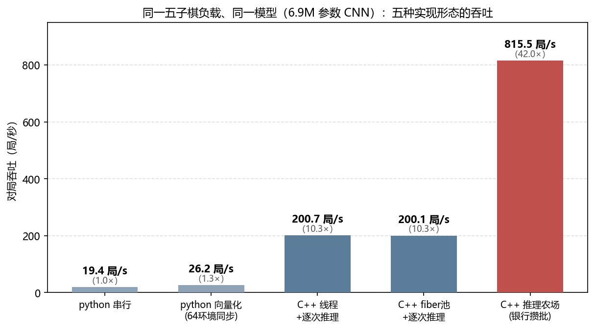

# GameInferfarm · 推理农场

[](https://github.com/SkYContact/GameInferfarm/actions/workflows/ci.yml)

**通用 C++ 游戏决策推理框架**——把"大量同构游戏并发推进 + 神经网络批量决策"做成游戏无关的库。
写一个 `GameAdapter` 接入你的游戏，剩下的并发、攒批、GPU 提交、取证全部交给农场。

面向自博弈（self-play）训练、强化学习评估、演化算法种群评估、对局数据生成这类
高吞吐负载的**批量推理层**：实测谱系 python 串行 → 本框架 116×（五子棋公开基准，
[docs/benchmark.md](docs/benchmark.md)）；支持 NVIDIA（ONNX Runtime CUDA / TensorRT）
与 AMD（DirectML）异构多卡混跑；确定性门常驻 CI。

关键词：自博弈加速 · self-play batched inference · 游戏AI 高吞吐 · RL 评估对局
生成 · 演化种群评估 · CUDA Graph · 零拷贝攒批 · fiber 调度

```
[English version](README.en.md)
```

## 为什么需要它

自博弈/强化学习评估/对局生成这类负载的瓶颈几乎从不在神经网络本身，而在：
每个决策一次线程唤醒的 OS 调度税、特征组装的同进程拷贝链、小批次付整批的
GPU 门票。推理农场把这三层做成游戏无关的机件（实测 7.5-8.7×，见
[docs/design-judgments.md](docs/design-judgments.md)）：

1. **fiber 调度器**：K 工人线程 + 每局一 fiber + per-worker 唤醒队列。推理等待
   =纤程让出（不睡 cv、不进 OS 运行队列）——唤醒税归零；链-工人亲和保住
   thread_local 语义，切换点装卸链寿命 TLS 帧。
2. **零拷贝槽位银行制**：N 家银行 × slots 槽 pinned、地址终身固定、每家一张
   专属 CUDA Graph。原子游标领号 → **组装直写槽**（零同进程拷贝）→ 满座自驱/
   闹钟发车 → close-drain（有界 µs）→ 只拷前 n 行 → 异步整批回放 → 旗标收割 →
   还池。池容量=在飞上限=天然背压。
3. **refit 热换**：RW1 权重 blob 毫秒级换心（演化/评估场景一代候选免烤引擎）。
4. **census 取证**：全原子状态机（人口恒等式 X≡0）、复活路径直方图、线程级
   CPU 普查、调度台循环分段——性能问题先有测量再有解释。

## 五子棋接入范例（无需训练任何模型）

[examples/gomoku](examples/gomoku) 用一个真实的完整游戏示范接入全流程：
**未训练一层 MLP**（450→64→225，权重由种子生成=逐位确定）vs **规则对手**
（能赢就赢/必须堵就堵/启发式落子）。它不会赢——但种子协议、直写槽、银行
攒批、收割回投、逐位确定性全部真实工作；换成你训练好的模型只是改一处模型
声明（或换 ort/trt 后端），适配器零改动。

```bash
build/Release/gomoku.exe --chains 8 --games 16 --show-board          # cpu 后端（默认，免 GPU）
# 真模型工件（一层 MLP → 钉批 onnx + TRT engine）：
python tools/bake_gomoku_mlp.py --slots 8 --hidden 64 --out models/gomoku_mlp.fb8.onnx --trt models/gomoku_mlp.fb8.trt
build/Release/gomoku.exe --backend ort --model models/gomoku_mlp.fb8.onnx   # ORT（含 CUDA Graph）
build-trt/Release/gomoku.exe --backend trt --engine models/gomoku_mlp.fb8.trt  # TRT（图+邮箱）
```

真模型实测（本机，32 局×2 银行）：三后端行为**逐位可比**（ORT 与 TRT 对
同一 fp32 模型指纹逐位同；银行 vs inline 各自逐位同）——玩具尺度下 CPU 后端
最快（MLP 太小，GPU 每批门票是纯开销），GPU 后端的吞吐价值在真模型尺度
（产线参考：[docs/provenance.md](docs/provenance.md)）。

### 公开基准：训练模型 + 实现谱系 + 多设备组（2026-09-22）

仓库自带一条**可复现的价值链**（`tools/` 一键再生，`docs/benchmark.md` 全口径）：

- **模型真会下棋**：连型评估老师自博弈 4000 局（34.1 万样本）→ BC 训练
  6.85M 参数 CNN（`models/gomoku_cnn.fb16.onnx` 随仓分发）→ 对内置规则
  对手胜率 **0/16（未训练）→ 7012/8192 = 85.6%**（先手 88.4% / 后手 82.9%）。
- **框架真跑得快**（8192 局同口径，每档 ≥3 跑中位）——python 串行 19.8
  局/s → python 向量化 25.9 → C++ 每链线程+逐次 190.2 → **C++ 推理农场
  （同卡 6 设备组×2 银行）≈2300 局/s**；谱系首尾 **116×**，同 C++ 同模型
  下 **12.1×**。
- **同一张卡还能再拆**：设备组=并行填充管线，1 组 780 → 2 组 1376（零
  额外硬件翻倍）→ 6 组 2303 局/s（8 组以上调度台过载反降）。
- **NVIDIA+AMD 异构混跑**：DirectML 通道（AMD 显卡/核显可直接用）；链
  钉扎保证跨厂商混跑重跑逐位一致；轻模型下独显+核显=单卡 1.8×。
- **行为逐位等价**：C++ 侧 5 腿（朴素 3 跑+冠军 2 跑）指纹全同、决策数
  全同（104175）、推理故障 0——从 190 提到 2300 局/s，八千多局棋一局没变。



```
[gomoku] 汇总: 先手 0/8, 后手 0/8, 综合 0/16 (0.0%)，决策 152，推理故障局 0
[gomoku] 16 局 / 0.05s；先手 0/8 后手 0/8；指纹 eef000cc10107e1c

终局样例棋盘（链 0 末局）：
   0123456789ABCDE
 0 ..............O
 4 ....O..X..OO.O.
 6 ......XXX......
 7 ......XXX......
 8 .O....XXX....O.
   ...（O=我方神经网络 X=对手规则——未训练模型被规则对手击败，符合预期）
```

### 接入你的游戏只需要这个

```cpp
#include "inferfarm/inferfarm.h"

struct MyGame : inferfarm::GameAdapter {
    void NewGame(uint64_t seed, bool we_first) override;      // 开局（清干净=确定性前提）
    bool AdvanceToDecision() override;                        // 推进到我方下一个决策点
    void AssembleInto(inferfarm::SlotWriter& slot) override;  // 特征直写槽行（零拷贝）
    int  CollectOutputs(inferfarm::OutputDest* d, int cap) override;  // 申报输出缓冲
    void ApplyResult() override;                              // 消费输出、推进局面
    void OnInferFail() override;                              // 推理故障=判负纪律
    bool IsDone() override;  int Outcome() override;          // 1 胜 0 负 -1 平
    bool WeAreFirst() override;  inferfarm::ITlsFrame* TlsFrame() override;
};

int main() {
    inferfarm::FarmConfig cfg;              // workers/banks/slots/window/stagger/model...
    cfg.model.backend = "cpu";              // "cpu" | "ort" | "trt"
    inferfarm::Farm farm;
    farm.Init(cfg);
    farm.RunLeg([](int chain, void*) -> inferfarm::GameAdapter* {
        return new MyGame();
    }, nullptr);
}
```

三条契约（详见 [include/inferfarm/game_adapter.h](include/inferfarm/game_adapter.h)）：
1. **advance 与 assemble 无挂起点**——银行 close-drain 有界的前提；
2. **行独立**——模型无 batchnorm 类跨行算子（银行不满整批照发、尾行旧数据无害）；
3. **逐位确定性由适配器保证**——种子协议：`game seed = seed0 + chain*per + game`。

有跨让出存活 thread_local 状态的游戏（如脚本引擎），把它装进
[`ITlsFrame`](include/inferfarm/tls_frame.h)（附 TLS 审计清单）——调度器在
切换点自动装卸。

## 快速开始

```bash
git clone https://github.com/SkYContact/GameInferfarm.git && cd GameInferfarm
cmake -S . -B build -G "Visual Studio 18 2026" -A x64   # 或任意支持的生成器
cmake --build build --config Release

build/Release/farm_test.exe    # 确定性门（G1-G7 全绿才算数）
build/Release/toy.exe          # 最小玩具（TLS 帧用法示范）
build/Release/gomoku.exe       # 五子棋范例
```

TRT 后端：`cmake -B build-trt -DINFERFARM_WITH_TRT=ON`
（`INFERFARM_TRT_INCLUDE_DIR` 指向含 NvInferRuntime.h 的目录）。

## 三后端

| 后端 | 批图 | 完成检测 | refit 换心 | 定位 |
|---|---|---|---|---|
| `cpu` | — | 即时 | ✓（demo 协议） | 无 GPU 全链验证、确定性门、CI |
| `ort` | enable_cuda_graph（银行会话绑调度台线程） | 整设备同步 | ✗（ORT 无此 API） | 不烤 TRT：调度/拷贝/攒批层收益全额 |
| `trt` | CUDA Graph 批捕获（一银行一图） | GPU 邮箱 4B 盖章 + volatile 自旋 | ✓ | 生产路线：提交合并 + 围栏税消灭 + 毫秒换心 |

三后端同一 `InferBackend` 接口，同一银行协议——吞吐差在提交层，行为逐位可比。

## 推理缓存（可选，KataGo NNCache 思想吸收）

`FarmConfig.cache_log2`（env `FARM_CACHE_LOG2`）> 0 即启用：键 = 组装行字节
128 位哈希 + 权重代次（换心自动失效），命中 = 跳过收割/往返、逐字节回放。
**适用面（实测）**：CPU 后端低命中率会亏（53% 命中 2.4× 慢——弃槽行照算+
  领号踩踏），高命中才赚（热缓存 100% 命中 430 vs 153 局/s）；GPU 后端批形状
  钉死=垃圾行免费，机械上纯赢（玩具尺度效应小于跑间噪声不可判，YGO 尺度见
  分晓）。指纹不变性由门 G7 保证。默认关。

## 多 GPU（设备挂银行，判决15）

`FarmConfig.devices` 每设备组一份 `(后端, device_id, ort_ep, 模型, 银行数)`；
组池/组窗独立轮转；**链 c 钉扎到组 c%n_groups**——异构设备（如 NVIDIA 主卡 +
AMD 核显/独显）下保"同配置重跑逐位同"（实测跨厂商指纹三跑全同）。同构双卡
（2× NVIDIA TRT）逐位门天然保。推理缓存按组命名空间。

五子棋范例 `--device` 语法（首个替换主设备，后续追加组；`share=` 链分配
权重，缺省均分，异构按算力配比如 `share=4`；`share=0`=该组不接链）：

```
gomoku --device ort,ep=cuda,dev=0,banks=2,share=4,model=m.onnx \
       --device ort,ep=dml,dev=1,banks=1,share=1,model=m.onnx,dir=D:/dml_rt/capi
```

**分组定律（实测）**：链被分组切薄 ⇒ 批密度稀释（小负载分组亏——双 CUDA
同构组也一样慢，非异构之罪）；链够稠 ⇒ 两组=两条并行填充管线（512 局尺度
均分异构 1113 局/s > 单卡 654）。真实算力场景按 share 配比或压 0。

AMD 卡走 `ep=dml`（DirectML，宿主绑定+同步 Run；需 onnxruntime-directml
构建，`pip install --target <dir> onnxruntime-directml` 后 `dir=` 指其
capi 目录——与 CUDA 构建同名冲突由框架自动改名共存）。TRT `device_id>0`
守卫已就位（单卡机未测，双同构卡即用）。

## 环境旋钮（显式 Config 为准，env 快速实验）

`FARM_FIBERS` `FARM_FIBER_WORKERS` `FARM_BANKS` `FARM_BANK_WINDOW_FLOOR`
`FARM_STAGGER_MS` `FARM_CENSUS` `FARM_CACHE_LOG2` `FARM_ORT_DIR`
`FARM_CUDA_DIR` `FARM_TRT_DIR`

## 目录

```
include/inferfarm/    公共头：types / backend / fiber_pool / bank / cache /
                      census / refit / game_adapter / tls_frame / farm
src/                  实现（bank.cpp=银行协议；backends/=cpu|ort|trt）
examples/toy/         最小玩具适配器（TLS 帧用法）
examples/gomoku/      五子棋接入范例（本 README 主角）
tests/                farm_test 确定性门 + refit_probe
tools/refit_blob.py   RW1 权重 blob 权威导出器
docs/                 design-judgments（实测判决）/ pitfalls（血律）/ provenance（来历）
```

## 测试与门

`farm_test` 承接产线验证纪律：
- **G1** 银行 vs inline 逐位一致（outcome+决策数+逐局指纹）——行独立+零基组装
  的自带性质，失败=有 bug；
- **G2** 同配置复跑全同；**G3** fiber vs 线程模式全同（TLS 帧纪律的行为级验证）；
- **G4** census 开=结果逐位同 + 人口恒等式 X≡0 + 复活路径有样本；
- **G5** refit 同 blob 逐位同 / 异 blob 必变 / RW1 负路径 fail fast；
- **G6** 五子棋真实接缝：银行 vs inline 逐位一致；
- **G7** 推理缓存：开=关逐位同（含纯命中路径二腿）+ 代次失效门 + 真实命中；
- **G8a** 多设备组（同构仿真）：分组=单组逐位同 + 重跑逐位同（真异构=R4/
  `--device` 演示，需双卡）；
- **R1/R2**（可选，真模型工件存在才跑，缺席=SKIP）：ORT/TRT 后端复跑逐位同
  + 银行 vs inline 逐位同（`gomoku_backend_test`）；
- **R4**（可选，`FARM_DML_DIR` 指向 onnxruntime-directml 的 capi 目录）：
  cuda+dml 异构双设备腿完成 + 复跑逐位同（跨厂商钉扎确定性）。

## 约束与路线

- 当前为 **Windows 优先**（fiber 走 Windows Fibers；POSIX 移植面收口在
  fiber_pool.cpp 的 Switch 族）。C++17，CMake ≥3.16。
- 路线：ORT/TRT 真模型实测基准（范式=KataGo benchmarkPureForward：barrier
  同起跑+每线程中位数+全体墙钟）、fp16 烤制档（int8 与 fp32 之间）、低负载
  混合发车（单局场景银行税的解药）、POSIX 纤程、更多游戏范例。
  （多 GPU 已落地：cuda+dml 异构实测跑通、跨厂商复跑逐位同；TRT device_id
  守卫就位待双同构卡实测。）

## 命名说明

仓库名 **GameInferfarm**；C++ 命名空间/目标名为短名 `inferfarm`

## 许可

[MIT](LICENSE)。TRT/ORT/CUDA 本体不随仓分发——运行时由各自官方渠道安装，
路径走 `ModelConfig`/`FARM_*` 指定。
